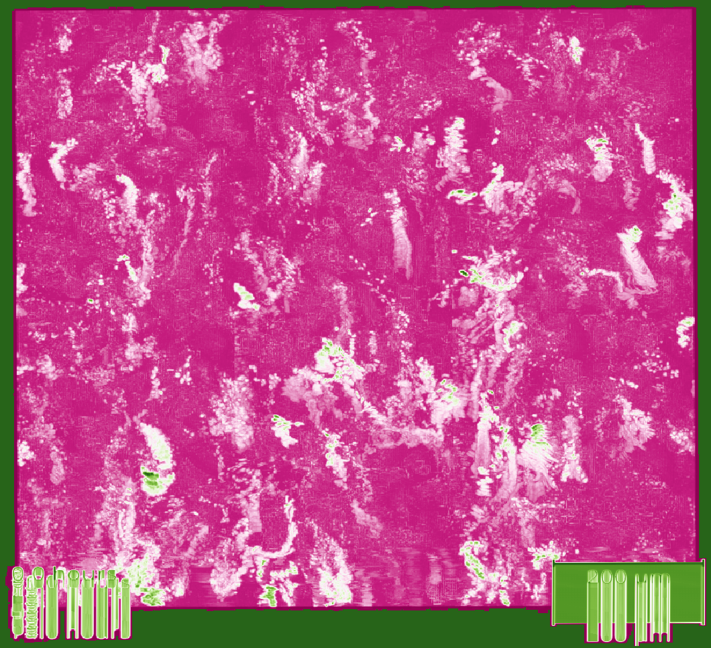

<!-- #region -->

# macro*het*

A repo for bringing together all of the threads of analyses for studying the single cell heterogeneity of human macrophages infected with _Mycobacterium tuberculosis_ (Mtb).

WORK IN PROGRESS

Currently mainly using it to back up various messy notebooks etc.

### This repository has 2 main aspects to it: labelling and analysis

1. The upstream labelling section is for the tiling, segmentation and tracking of timelapse microscopy data of human macrophages infected with _Mycobacterium tuberculosis_.
2. The downstream analysis section is for investigating and interrogating the tracks created in the first section as well as any further biological analysis of the microscopy data.

Both sections contain `dev` folders where the bulk of the WIP notebooks will be located and zipped in archive. The more generally applicable and polished notebooks will be in the main directories of each section.

<!-- #endregion -->
